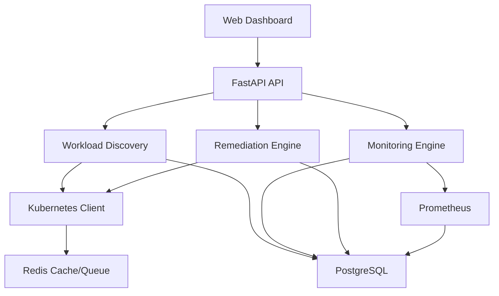

# Opscode: Kubernetes Operations Platform

[](https://www.python.org/downloads/)
[](https://opensource.org/licenses/MIT)
[](https://github.com/psf/black)

## Overview

Opscode is an open-source Kubernetes operations platform that provides real-time automated monitoring, incident detection, and safe remediation for applications running on Kubernetes clusters.

### Problem Statement

Operating open-source workloads across Kubernetes clusters requires continuous monitoring, incident detection, and safe automated remediation. Operations teams need visibility into workload health, proactive issue detection, and automated response mechanisms while maintaining safety and reliability.

### Solution

Opscode provides a comprehensive platform that:
- **Discovers** Kubernetes workloads across namespaces
- **Monitors** application health with configurable thresholds
- **Detects** operational problems automatically
- **Generates** alerts and incidents
- **Performs** safe automated remediation actions
- **Stores** operational history for analysis
- **Provides** REST APIs and web dashboard
- **Produces** structured logs and metrics

## Architecture



### Architecture Layers

- **API Layer**: FastAPI endpoints with automatic OpenAPI documentation
- **Service Layer**: Business logic for workloads, monitoring, incidents, remediation
- **Domain Layer**: Core models and business rules
- **Repository Layer**: Database access patterns
- **Infrastructure Layer**: Kubernetes client, Redis, PostgreSQL integration
- **Monitoring Layer**: Prometheus metrics and Grafana dashboards
- **Cloud Abstraction**: Clean interfaces for AWS/GCP integrations

## Features

### Core Capabilities

- **Workload Discovery**: Automatic discovery of Deployments, StatefulSets, DaemonSets, Pods, and Services
- **Health Monitoring**: Real-time health checks for CPU, memory, restarts, replica availability
- **Incident Detection**: Automatic incident creation based on configurable thresholds
- **Automated Remediation**: Safe restart, scale, and rollout restart operations
- **Safety Mechanisms**: Dry-run mode, cooldown periods, namespace whitelisting, retry limits
- **Operational History**: Complete audit trail of all operations
- **REST API**: Comprehensive API with Swagger documentation
- **Web Dashboard**: Real-time visualization of workloads, incidents, and remediations
- **Prometheus Metrics**: Built-in metrics for all operations
- **Grafana Dashboards**: Pre-configured dashboards for monitoring
- **Structured Logging**: JSON logs with correlation IDs
- **Kubernetes Security**: RBAC with least privilege permissions

### Advanced Features

- **Distributed Locking**: Redis-based coordination for remediation actions
- **Caching**: Redis caching for workload information
- **Retry Logic**: Exponential backoff for transient failures
- **Graceful Shutdown**: Clean termination of background workers
- **Health Checks**: Liveness and readiness probes
- **Type Safety**: Full type hints with mypy validation
- **Testing**: Comprehensive unit and integration tests

## Technology Stack

### Backend
- **Python 3.12+**: Modern Python with async/await support
- **FastAPI**: High-performance async web framework
- **Pydantic**: Data validation with type hints
- **SQLAlchemy**: Async ORM for database operations
- **PostgreSQL**: Persistent operational data storage
- **Redis**: Caching, distributed locks, and temporary state
- **Kubernetes Python Client**: Kubernetes API integration
- **APScheduler**: Background task scheduling
- **Tenacity**: Retry logic with exponential backoff
- **Structlog**: Structured JSON logging

### Infrastructure
- **Docker**: Containerization with multi-stage builds
- **Kubernetes**: Container orchestration
- **Helm**: Package management for Kubernetes
- **Docker Compose**: Local development environment
- **Prometheus**: Metrics collection and alerting
- **Grafana**: Visualization and monitoring dashboards

### Development Tools
- **pytest**: Testing framework with async support
- **pytest-asyncio**: Async test support
- **pytest-cov**: Code coverage reporting
- **ruff**: Fast Python linter
- **black**: Code formatter
- **mypy**: Static type checking
- **alembic**: Database migrations

## Local Setup

### Prerequisites

- Python 3.12+
- Docker and Docker Compose
- (Optional) kind or minikube for local Kubernetes
- (Optional) kubectl for Kubernetes operations

### Installation

1. **Clone the repository**:
```bash
git clone https://github.com/Leena-Sri/python-k8s-opscode.git
cd python-k8s-opscode
```

2. **Run setup script**:
```bash
# Linux/Mac
./scripts/setup.sh

# Windows
.\scripts\setup.ps1
```

3. **Set environment variables**:
```bash
cp .env.example .env
# Edit .env with your configuration
```

4. **Start dependencies**:
```bash
make docker-up
```

5. **Run database migrations**:
```bash
make migrate-up
```

6. **Start the application**:
```bash
make run
```

The API will be available at `http://localhost:8000`

### Quick Start with Docker Compose

```bash
# Start all services (PostgreSQL, Redis, Prometheus, Grafana, Opscode)
make docker-up

# View logs
docker-compose logs -f opscode

# Stop services
make docker-down
```

### Access Points

- **API**: http://localhost:8000
- **API Documentation**: http://localhost:8000/docs
- **Dashboard**: Open `dashboard/index.html` in your browser
- **Grafana**: http://localhost:3000 (admin/admin)
- **Prometheus**: http://localhost:9090

## Kubernetes Setup

### Using kind (Local Kubernetes)

1. **Install kind**:
```bash
go install sigs.k8s.io/kind@v0.20.0
```

2. **Create cluster**:
```bash
kind create cluster --name opscode
```

3. **Load Docker image**:
```bash
kind load docker-image python-k8s-opscode:latest --name opscode
```

4. **Apply manifests**:
```bash
make k8s-apply
```

5. **Access the service**:
```bash
kubectl port-forward -n opscode svc/opscode 8000:80
```

### Using Helm

```bash
# Install
helm install opscode ./helm/opscode

# Upgrade
helm upgrade opscode ./helm/opscode

# Uninstall
helm uninstall opscode
```

## API Documentation

### Health Endpoints

- `GET /health` - Basic health check
- `GET /health/ready` - Readiness check
- `GET /health/live` - Liveness check

### Workload Endpoints

- `GET /api/v1/workloads` - List all workloads
- `GET /api/v1/workloads/{name}?namespace={namespace}` - Get specific workload
- `GET /api/v1/namespaces` - List namespaces
- `GET /api/v1/pods` - List pods

### Incident Endpoints

- `GET /api/v1/incidents` - List incidents (with filters)
- `GET /api/v1/incidents/{id}` - Get specific incident
- `POST /api/v1/incidents/{id}/acknowledge` - Acknowledge incident
- `POST /api/v1/incidents/{id}/resolve` - Resolve incident

### Remediation Endpoints

- `GET /api/v1/remediation/actions` - List remediation actions
- `POST /api/v1/remediation/{workload}/restart?namespace={namespace}` - Restart workload
- `POST /api/v1/remediation/{workload}/scale?namespace={namespace}&replicas={count}` - Scale workload

### Metrics Endpoints

- `GET /api/v1/metrics/summary` - Get metrics summary
- `GET /metrics` - Prometheus metrics

## Monitoring

### Prometheus

Opscode exposes Prometheus metrics on `/metrics` endpoint:

- `opscode_workloads_total` - Total workloads by namespace and kind
- `opscode_workloads_healthy` - Healthy workloads by namespace
- `opscode_workloads_degraded` - Degraded workloads by namespace
- `opscode_workloads_unhealthy` - Unhealthy workloads by namespace
- `opscode_incidents_total` - Total incidents by severity and type
- `opscode_incidents_open` - Currently open incidents by severity
- `opscode_remediation_total` - Total remediation actions by action and status
- `opscode_remediation_failures_total` - Failed remediation actions
- `opscode_health_check_duration_seconds` - Health check duration
- `opscode_api_requests_total` - API request count by method, endpoint, status
- `opscode_api_request_duration_seconds` - API request duration

### Grafana Dashboard

Pre-configured dashboards include:
- Workload overview with health status
- Incident trends and severity distribution
- Remediation success/failure rates
- API performance metrics
- Resource utilization

## Remediation Safety

Opscode implements multiple safety mechanisms:

### Configuration

```yaml
remediation:
  enabled: true
  dry_run: true  # Default for local development
  max_retries: 3
  cooldown_seconds: 300
  allowed_namespaces: ["default", "staging"]
  allowed_workloads: []  # Empty means all workloads allowed
```

### Safety Features

1. **Dry Run Mode**: Simulate remediation without actual changes
2. **Namespace Whitelisting**: Only operate in approved namespaces
3. **Workload Whitelisting**: Only operate on approved workloads
4. **Cooldown Periods**: Prevent repeated remediation on same workload
5. **Retry Limits**: Maximum retry attempts with exponential backoff
6. **Distributed Locking**: Prevent concurrent remediation operations
7. **Recovery Verification**: Verify remediation success before resolving incidents
8. **Audit Logging**: Complete audit trail of all remediation actions

## Testing

### Unit Tests

```bash
# Run all unit tests
make test-unit

# Run specific test file
pytest tests/unit/test_config.py -v

# Run with coverage
pytest tests/unit/ --cov=app --cov-report=html
```

### Integration Tests

```bash
# Run all integration tests
make test-integration

# Run specific integration test
pytest tests/integration/test_api.py -v
```

### Test Coverage

```bash
# Generate coverage report
make test

# View HTML coverage report
open htmlcov/index.html
```

## Architecture Decisions

### PostgreSQL vs Redis

**PostgreSQL** is used for persistent operational data:
- Workloads, incidents, alerts, remediation actions
- Historical data and audit trails
- Complex queries and relationships
- ACID compliance for critical operations

**Redis** is used for temporary operational state:
- Caching workload information (TTL-based)
- Distributed locks for remediation coordination
- Cooldown periods (TTL-based)
- Real-time metrics and counters

### FastAPI Choice

FastAPI was chosen for:
- Native async/await support
- Automatic OpenAPI documentation
- Pydantic integration for validation
- High performance
- Type safety with mypy
- Modern Python patterns

### Kubernetes Client Abstraction

The Kubernetes client is abstracted behind an interface to:
- Enable mock implementations for testing
- Support future multi-cluster scenarios
- Allow cloud-specific implementations
- Simplify testing without real Kubernetes clusters

### Background Monitoring

Background monitoring is implemented with APScheduler:
- Periodic workload discovery
- Health check evaluation
- Incident detection
- Remediation evaluation
- Modular design for future worker separation

### Remediation Safety

Safety mechanisms include:
- Dry-run mode by default in development
- Namespace and workload whitelisting
- Cooldown periods with Redis TTL
- Distributed locking
- Retry logic with exponential backoff
- Recovery verification
- Complete audit logging

### Retry Strategy

Tenacity is used for retry logic:
- Exponential backoff
- Maximum retry limits
- Configurable delays
- Specific policies for different operations
- Failure tracking and monitoring

### Observability

Observability is implemented through:
- Structured JSON logging with correlation IDs
- Prometheus metrics for all operations
- Grafana dashboards for visualization
- Health check endpoints
- Request/response logging
- Error tracking and alerting

### RBAC

Kubernetes RBAC follows least privilege:
- ServiceAccount for the application
- Role with specific permissions
- RoleBinding to assign permissions
- Only necessary permissions for operations
- Namespace-scoped for isolation

## Future Improvements

- **Multi-cluster support**: Manage workloads across multiple Kubernetes clusters
- **AWS/GCP integrations**: Cloud-specific metrics and operations
- **Advanced anomaly detection**: Machine learning-based anomaly detection
- **GitOps integration**: Integration with ArgoCD/Flux
- **OpenTelemetry**: Distributed tracing and enhanced observability
- **Distributed workers**: Separate worker processes for scalability
- **Custom remediation strategies**: User-defined remediation policies
- **Slack/Teams integration**: Alert notifications via chat platforms
- **Webhook support**: Custom webhook integrations
- **Policy engine**: More sophisticated remediation policies

## Development Workflow

```bash
# Format code
make format

# Lint code
make lint

# Type check
make typecheck

# Run tests
make test

# Build Docker image
make docker-build

# Start development environment
make docker-up

# Apply to Kubernetes
make k8s-apply
```

## Contributing

Contributions are welcome! Please see [CONTRIBUTING.md](CONTRIBUTING.md) for guidelines.

## Security

For security considerations, please see [SECURITY.md](SECURITY.md).

## Acknowledgments

- Built with modern Python async/await patterns
- Inspired by Kubernetes best practices
- Designed for operational excellence
- Focused on safety and reliability
